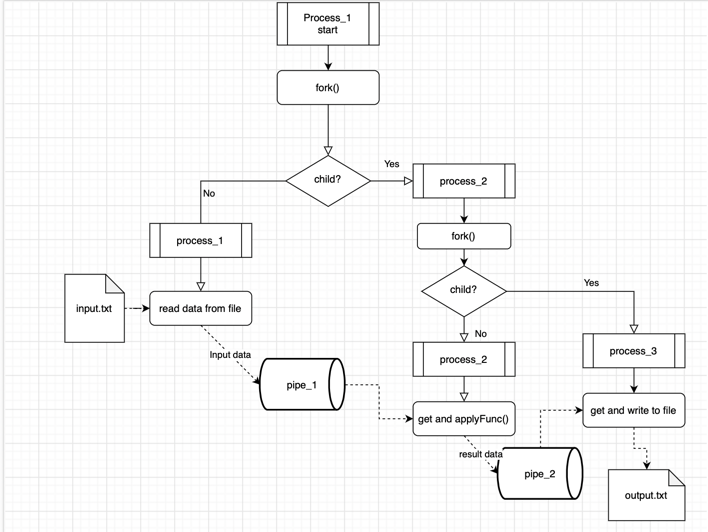
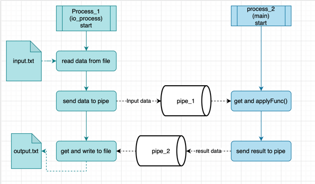
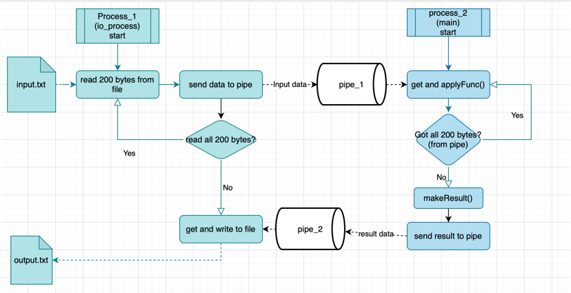
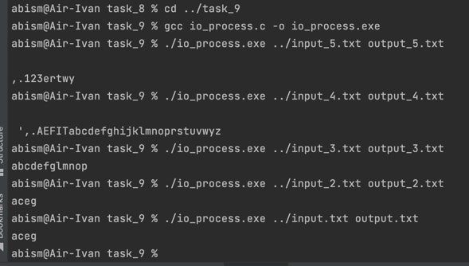

# OS_HW_1

# Операционные системы. ИДЗ № 1. Вариант 33 <br/> Киселев Иван Александрович БПИ217.

## Условие:

> Разработать программу, которая на основе анализа двух ASCII строк формирует на выходе строку, содержащую символы, присутствующие в обеих строках (пересечение символов). Каждый символ в соответствующей выходной строке должен встречаться только один раз.

## Описание репозитория:

### Решения задачи на C сразу на 10 балов

**Папки с решениями, находятся в корневой папке репозитория**

Каждая папка содержит в себе:

> * Файлы на языке C с решением задачи на указанный в названии папки балл
>
> * Исполняемые файлы
>
> * Результаты прогонов на тестовых файлах, лежащих в корневой папке репозитория

**Текстовые файлы с входными данными для тестов, также лежат в корневой папке репозитория**

## Отсчет:

### Формат входных данных

На вход поступает две строки, согласно условию, но так как по условию сказано, что информация считывается из одно файла,
то был выделен один символ '~', который является разделителем двух строк в исходном файле, то есть формат исходного
файла выглядит так:
> string_1~string_2

### Как запускать программу

Программы сначала компилируются

```
gcc main.c -o main.exe
```

Затем запускаются

```
./main.exe ../input.txt output.txt
```

Для решений с двумя независимыми процессами вот так:

```
gcc io_process.c -o io_process.exe
./io_process.exe ../input.txt output.txt
```

```
gcc main.c -o main.exe
./main.exe  
```

### Общие схемы решаемых задач
applyFunc() - функция выполняющее условие варианта 33

В конце пути процесса в блок-схеме идет его завершение

**Задание на 4 балла:**

Три дочерних процесса: процесс_1 -> процесс_2 -> процесс_3

> Все взаимодействия на схеме:
> 

**Задание на 5 баллов**

Все точно так же как в предыдущем, но используются именованные каналы pipe_1 и pipe_2

**Задание на 6 баллов**

Два дочерних процесса: процесс_1 -> процесс_2

> Все взаимодействия на схеме:
> 
> Можно сказать что процесс_1 работает с файлами, а процесс_2 обрабатывает данные

**Задание на 7 баллов**

Все точно так же как в предыдущем, но используются именованные каналы pipe_1 и pipe_2

**Задание на 8 баллов**

Два независимых процесса, один создается запуском io_process.exe, другой main.exe

Передача данных задействует именованные каналы



**Задание на 9 баллов**


Два независимых процесса, один создается запуском io_process.exe, другой main.exe

Передача данных задействует именованные каналы, данные читаются и передаются в циклах, все буферы не превышают 200байт
согласно условию

### Тестирование программы и файлы для тестирования
Произведены тесты всех программ, результаты расположены в папках программ


